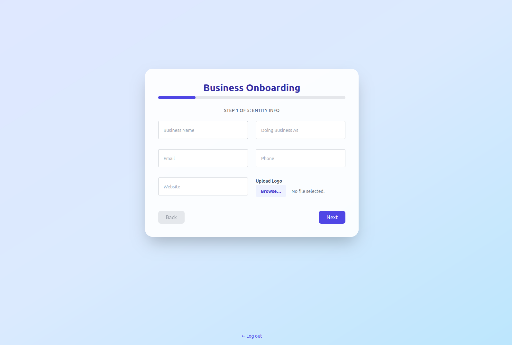
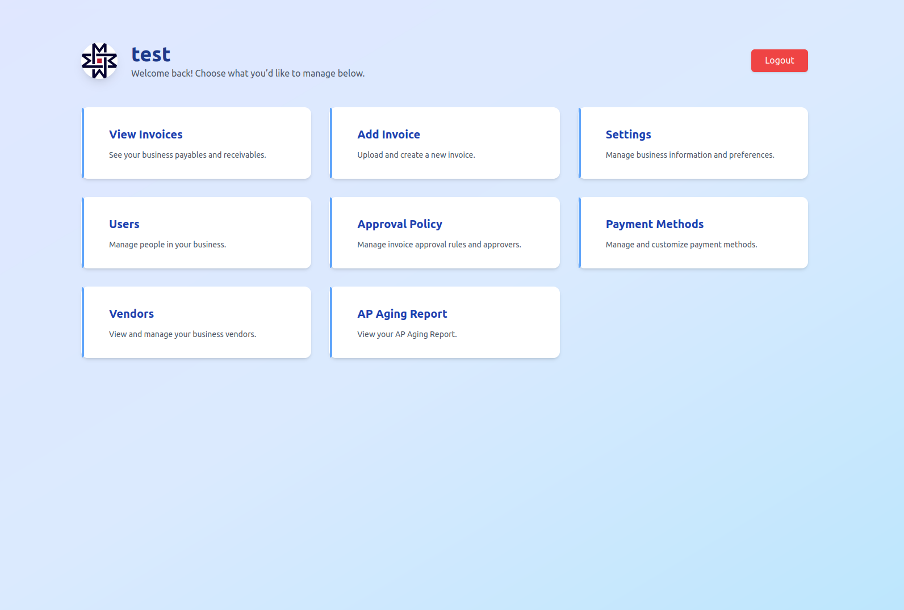
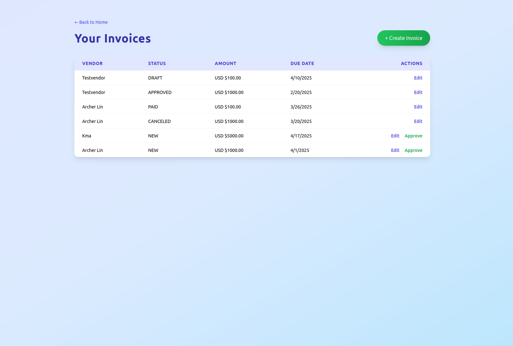
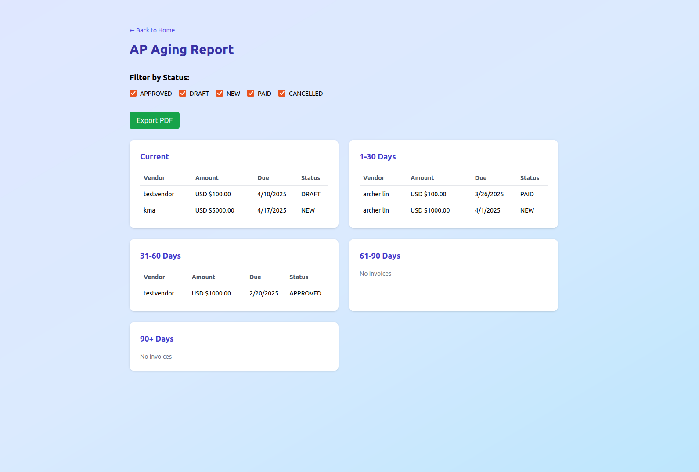

# 💸 Mercoa BillPay SaaS — Fullstack Demo App

This is a full-featured, production-grade **Accounts Payable** SaaS platform built for the [Mercoa Interview Project](https://www.mercoa.com/). It uses the **Mercoa API and React SDK** to build a bill management system from the ground up — including KYB onboarding, invoice workflows, approval rules, vendors, and payment methods.

> ✅ Everything works. Log in, onboard, invoices, approval policy, approve, mark as paid, ap aging report, and more.

## 🔧 Tech Stack

- **Frontend**: React + Tailwind CSS
- **Backend**: Django (Python)
- **Database**: SQLite / PostgreSQL (Django ORM)
- **API Integration**: Mercoa REST API + `@mercoa/react` SDK
- **Authentication**: Django User + Profile (with Mercoa `entity_id`)

## 🌟 Features

| Feature | Description |
|--------|-------------|
| ✅ Business Login | Account creation and login (fake/hardcoded ok) |
| ✅ Business KYB Onboarding | Multi-step UI with document uploads, Terms of Service, etc |
| ✅ View Invoices | List, filter, and view invoices using Mercoa's React components |
| ✅ Create & Upload Invoices | Draft, edit, assign vendors, OCR, and submit for approval |
| ✅ Approvals Workflow | Create policies, assign approvers, approve or reject invoices |
| ✅ Entity Users | Add/edit users with roles (admin/approver/general) |
| ✅ Vendors Management | Auto-pulled from invoices, full UI for viewing/editing vendors |
| ✅ Payment Methods | Add/edit bank accounts and checks using Mercoa UI |
| ✅ AP Aging Report | Automatically calculated and displayed summary (support PDF export!) |
| ⚡ Fully Embedded | Custom UI powered by Mercoa SDK + JWT tokens |

## 🧲 Demo

```
🌐 [https://archerlinn.github.io/mercoa_billpay/]
🧑‍💼 Email: test@test.com
🔐 Password: test123
```

## 🧠 Architecture

### Session Flow

1. Django generates a **Mercoa entity token (JWT)** for the logged-in business.
2. React frontend uses `<MercoaSession token={...}>` to wrap all Mercoa components.
3. React + Django communicate over REST API endpoints for onboarding, user management, and CRUD actions.
4. Data is synced locally for user display and logic (optional but recommended for real apps).

### Core Components

- `SignupForm`: Handles account creation
- `OnboardingForm`: Multi-step KYB onboarding with advanced fields
- `InvoicesPage`: Embedded Mercoa invoice table, draft/submit/approve/pay flow
- `PayableDetailsV1`: Used for editing and submitting invoices
- `ApprovalPoliciesPage`: UI to manage approval rules (Mercoa API)
- `EntityUsersPage`: Add/edit users with dropdown roles
- `VendorsPage`: List vendors dynamically from invoices
- `PaymentMethodsPage`: Add/edit payment methods (bank accounts/checks/cards)

## 🛠️ Development

### Backend

```bash
cd backend/
pip install -r requirements.txt
python manage.py runserver
```

### Frontend

```bash
cd frontend/
npm install
npm run dev
```

> Make sure your backend is running at `localhost:8000` and frontend at `localhost:3000`.

## 🏦 Environment Variables

Create a `.env` in your Django project with:

```env
MERCOA_API_KEY=your_api_key
MERCOA_ORG_ID=your_org_id
```

## 🛠️ Screenshots

| Page | Screenshot |
|------|------------|
| Onboarding |  |
| HomePage |  |
| View Invoice |  |
| Approval Policy |  |
| AP Aging Report |  |